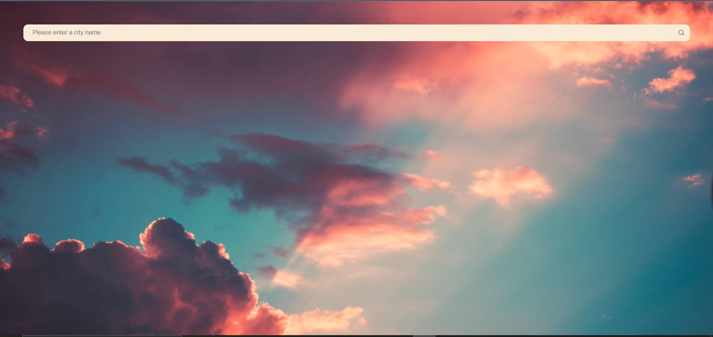
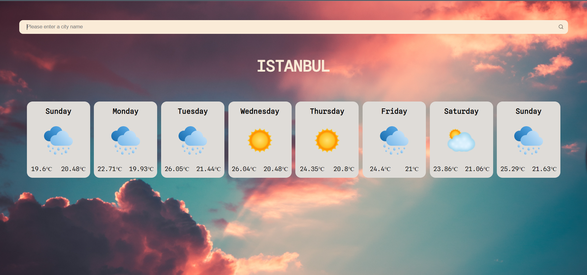
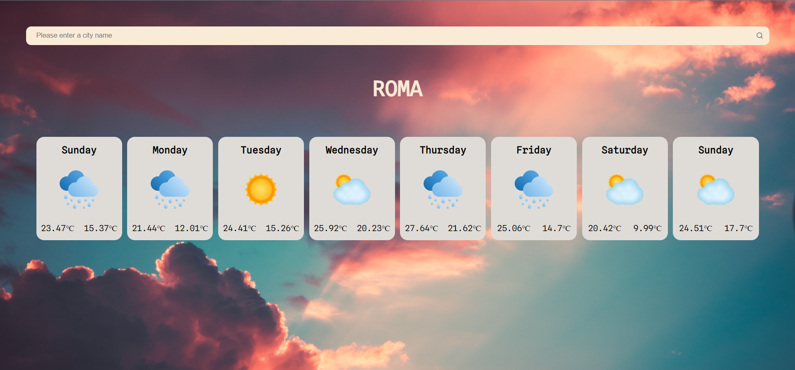

# REACT WEATHER APP

 

✔️ For live project please click [here]('https://react-weather-app-rho-sage.vercel.app/')

 

 
 

 
 

 
 

 
 

## USED TECHNOLOGIES

 

✔️ React 
✔️ Context Api 
✔️ Axios 
✔️ Open Weather Api 
